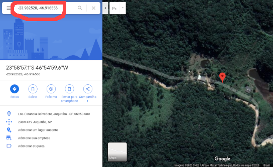
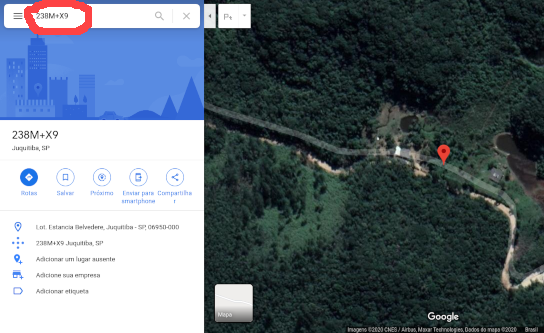

# tests.pluscodes
Simple java offline implementation of pluscodes

## What does this code do
It converts a latitude and longitude into a PlusCode, in three formats: Full, Within and Shortened. The conversion is made offline, without any remote API call.

## What this code doesn't do
It does not shows a semantic form of address, with city name, country name, or other names, like streets, avenues, or even house numbers.

## References

- https://en.wikipedia.org/wiki/Open_Location_Code
- https://plus.codes/developers
- https://github.com/google/open-location-code
- https://github.com/google/open-location-code/blob/master/docs/olc_definition.adoc
- https://github.com/google/open-location-code/blob/master/docs/specification.md

## Building

Before start, check the basic requirements: Java 8 or higher and Maven

```sh
$ git clone https://github.com/google/open-location-code
$ cd cd open-location-code/java/
$ cd ../../
$ git clone https://github.com/Scicrop/tests.pluscodes
$ cd tests.pluscodes
$ mvn package
```
If you are using Eclipse IDE and have this problem: **Plugin execution not covered by lifecycle configuration: com.diffplug.spotless:spotless-maven-plugin:1.23.0:check (execution: spotless, phase: compile)** in the pom.xml from open-location-code package you can just comment the **\<execution>** block inside pom.xml.

## Running

```sh
$ java -jar target/tests.pluscodes-0.0.1-jar-with-dependencies.jar -23.982528 -46.916556
```


## Results

Based on the above example, that uses this location: -23.982528 -46.916556. You can see in the following images, that both latitude/longitude and pluscode points to the same location.


https://www.google.com.br/maps/place/588M238M%2BX9/@-23.98256,-46.9176568,336m/data=!3m1!1e3!4m5!3m4!1s0x0:0x0!8m2!3d-23.9825625!4d-46.9165625


https://www.google.com.br/maps/place/23%C2%B058'57.1%22S+46%C2%B054'59.6%22W/@-23.982528,-46.9187447,671m/data=!3m2!1e3!4b1!4m5!3m4!1s0x0:0x0!8m2!3d-23.982528!4d-46.916556
